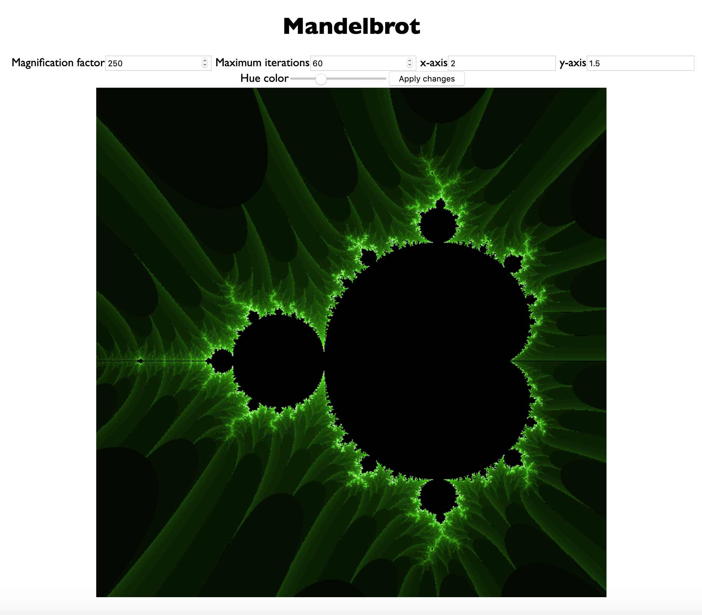

# Mandelbrot

Mandelbrot fractal in Vanilla JS
The algorithm behind the Mandelbrot is built according to the tutorial from [Progur](https://progur.com/2017/02/create-mandelbrot-fractal-javascript.html)

